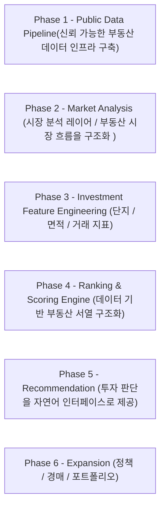

# 고강남(Go-KangNam)
---
# 러너 지원 전 꼭 읽어주세요
- 지원하실 때 아래 질문들에 대한 본인의 답변을 함께 작성해 주세요.

```
1️⃣ 부동산 서열에 대한 관점
빌더는 “부동산에는 구조적인 서열이 존재한다”고 생각합니다.
이에 동의하는지 또는 동의하지 않는지 밝히고, 그 이유를 자유롭게 서술해 주세요. 단순 의견도 좋습니다. 본인의 생각을 솔직하게 작성해 주세요.

2️⃣ 순수 다주택자의 기준
“순수 다주택자”는 몇 년 이상 보유해야 해당된다고 생각하십니까?
본인이 생각하는 기준과 그 이유를 함께 작성해 주세요.

3️⃣ 일시적 2주택자의 매도 기한
일시적 2주택자의 경우 기존 주택을 언제까지 매도해야 한다고 알고 계십니까?
본인이 생각하는 기준을 작성해 주세요.
```

---



