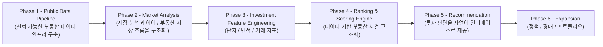

# 고강남(Go-KangNam)
---
# 러너 지원 전 꼭 읽어주세요
- 지원하실 때 아래 질문들에 대한 본인의 답변을 함께 작성해 주세요.

```
1️⃣ 부동산 서열에 대한 관점
빌더인 저는 “부동산에는 구조적인 서열이 존재한다”고 생각합니다.
이에 동의하는지 또는 동의하지 않는지 밝히고, 그 이유를 자유롭게 서술해 주세요. 단순 의견도 좋습니다. 본인의 생각을 솔직하게 작성해 주세요.

2️⃣ 순수 다주택자의 기준
“순수 다주택자”는 몇 년 이상 보유해야 해당된다고 생각하십니까?
본인이 생각하는 기준과 그 이유를 함께 작성해 주세요.

3️⃣ 일시적 2주택자의 매도 기한
일시적 2주택자의 경우 기존 주택을 언제까지 매도해야 한다고 알고 계십니까?
본인이 생각하는 기준을 작성해 주세요.
```
---

## 🔍 빌더의 문제의식

> 💡 저는 **내 집 마련이라는 명확한 목표**를 가지고 있습니다.

하지만 현재의 부동산 플랫폼들은 투자 결정을 내리기 위해 필요한 데이터를 충분히 제공하지 못하고 있습니다.

- 정보는 흩어져 있고
- 직접 찾아보고 해석해야 하며
- 판단은 결국 감과 경험에 의존하는 경우가 많습니다

*반면, 주식 시장의 HTS/MTS는 다릅니다.*

- 가격
- 수급
- 추세
- 지표
- 리스크 분석

투자자가 **스스로 판단할 수 있도록 구조화된 데이터**를 제공합니다.

> 저는 이 차이가 이상하다고 느꼈습니다.
> 

부동산 데이터가 없는 것은 아니지만 투자자가 스스로 판단할 수 있을 만큼 구조화되어 제공되고 있지도 않다고 생각합니다. 

정보는 존재하지만 흩어져 있고, 해석은 각자의 몫으로 남아 있습니다.

이 프로젝트는 그 간극을 줄이기 위한 시도입니다.

**고강남(Go-KangNam)**은 단순 매물 추천 서비스가 아닙니다.

**부동산 시장을 데이터로 구조화하고, 투자 판단 로직을 설계하는 시스템을 만드는 프로젝트입니다.**

> 2014~2015년과 같은 기회가 다시 온다면 감이 아닌 데이터 기반 의사결정으로
> 
> 
> ***내 집 마련***을 하고 싶습니다.
> 

이 프로젝트는 그 준비 과정입니다.

---

### 🤝 같이 하고 싶은 러너

- 이러한 문제의식에 공감하는 분

- 실제로 내 집 마련을 목표로 하는 분

- 감이 아닌 데이터 기반 의사결정을 고민하는 분

- 단순 구현이 아닌, 함께 사고하고 구조화할 분

---

# 🗺 Project Roadmap




