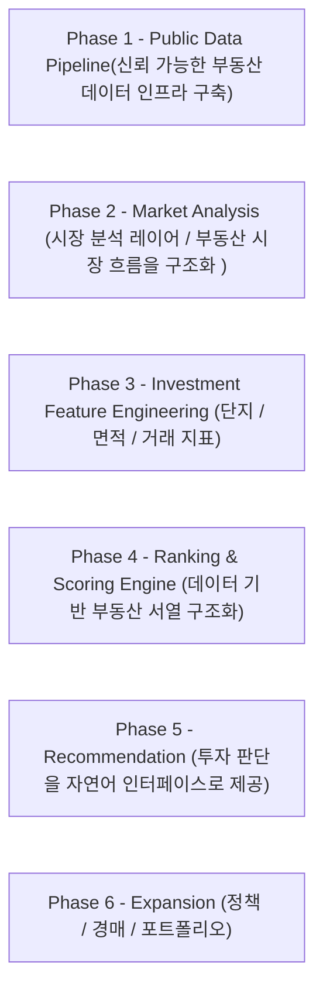

# 고강남(Go-KangNam)

---

```mermaid
flowchart LR
  A["Phase 1 - Public Data Pipeline(신뢰 가능한 부동산 데이터 인프라 구축)"]
  B["Phase 2 - Market Analysis (시장 분석 레이어 / 부동산 시장 흐름을 구조화 )"]
  C["Phase 3 - Investment Feature Engineering (단지 / 면적 / 거래 지표)"]
  D["Phase 4 - Ranking & Scoring Engine (데이터 기반 부동산 서열 구조화)"]
  E["Phase 5 - Recommendation (투자 판단을 자연어 인터페이스로 제공)"]
  F["Phase 6 - Expansion (정책 / 경매 / 포트폴리오)"]
```
